## ConnectED

Introducing our app that effortlessly links students with mentors in their chosen fields. Seamlessly connect based on courses or streams, fostering knowledge exchange. Ask questions, receive expert answers, and enhance your educational journey with ease.

### Features of Application
- User Authentication
- Post Question and their answer (Used Perspective API to filter out toxic language)
- Like or Dislike answers
- Report questions and answers (Admin will remove them)
- Send message request, if request gets accepted, start messaging


### Run Locally
For Backend

```
venv\Scripts\activate
cd backend
pip install -r backendrequirements.txt
python manage.py createsuperuser
python manage.py migrate
python manage.py runserver 
```
Change API url if backend is not running at 169.254.37.113:8000

For Frontend

```
venv\Scripts\activate
cd frontend
npm install
npm start
```


### Screenshots
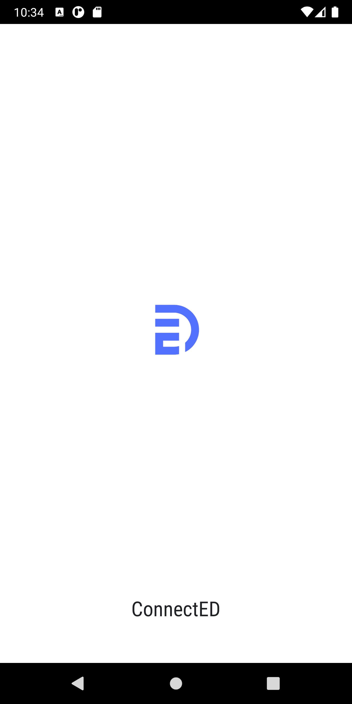
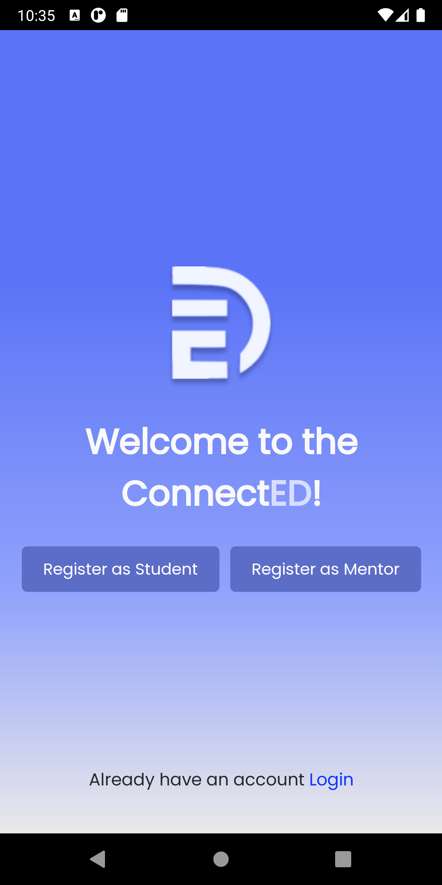


#### Authentication

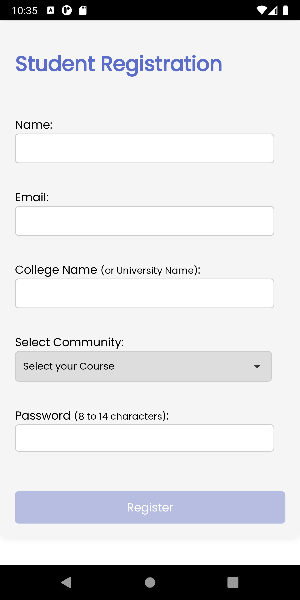 
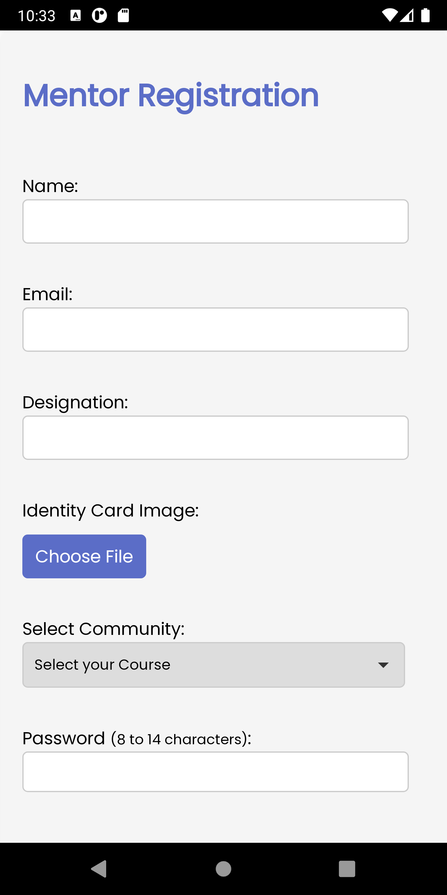 

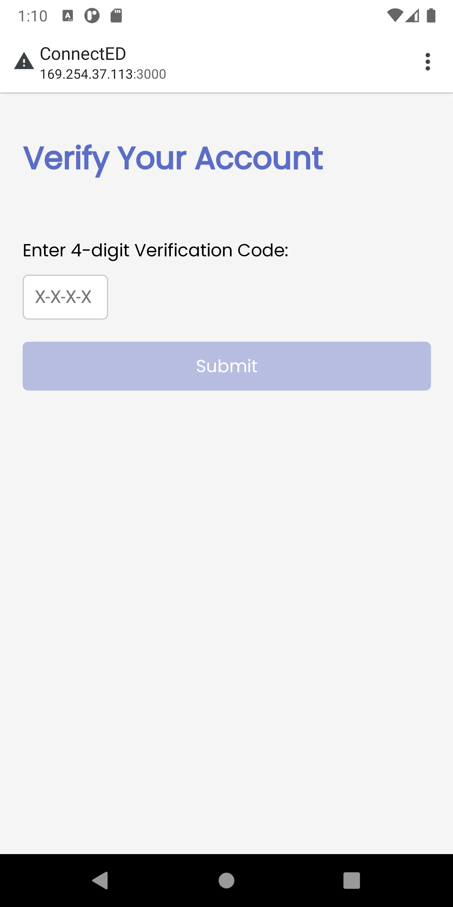
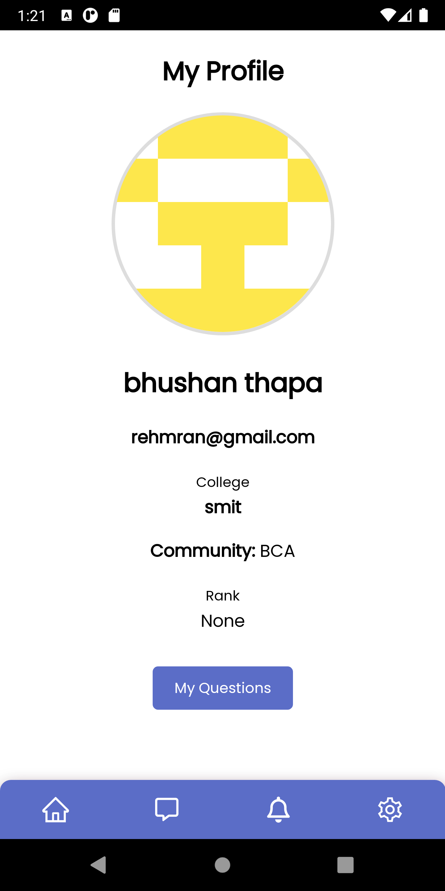

#### Questions & Answers

 
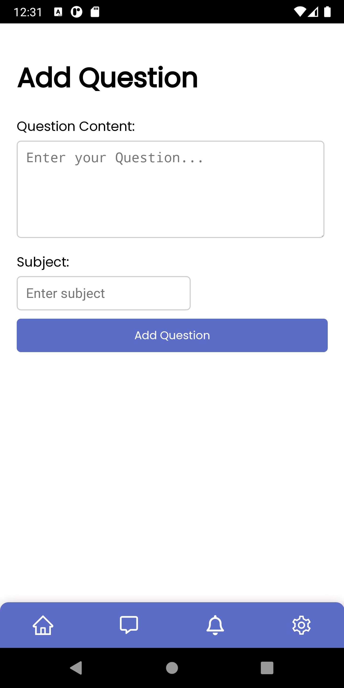
<br>
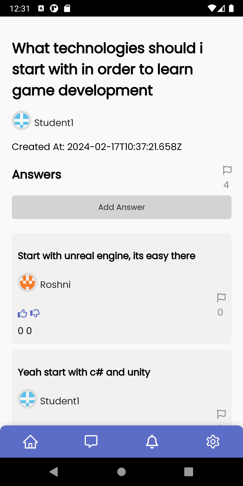
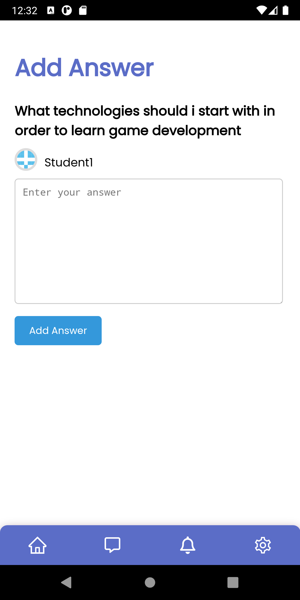

#### Message

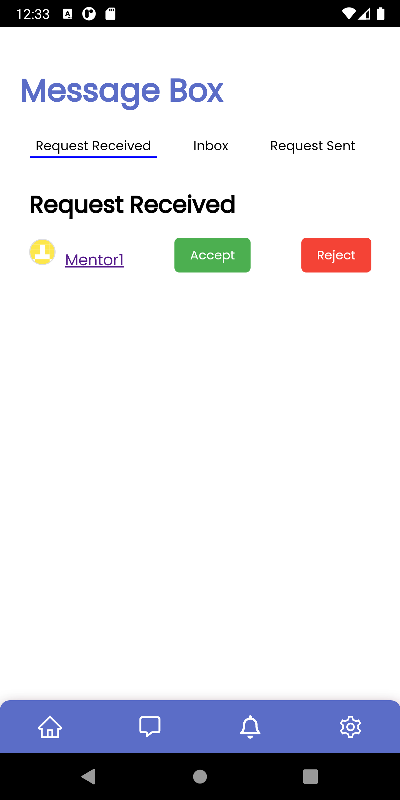 
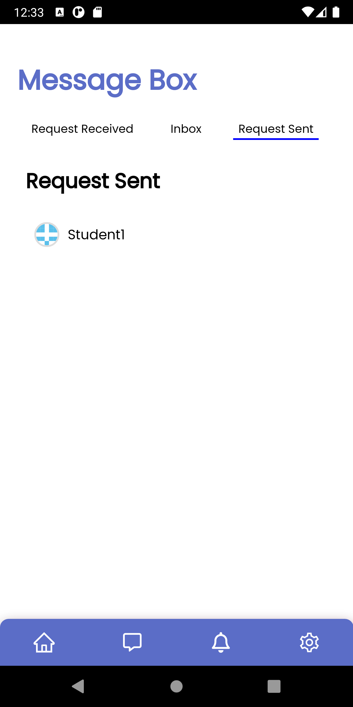 
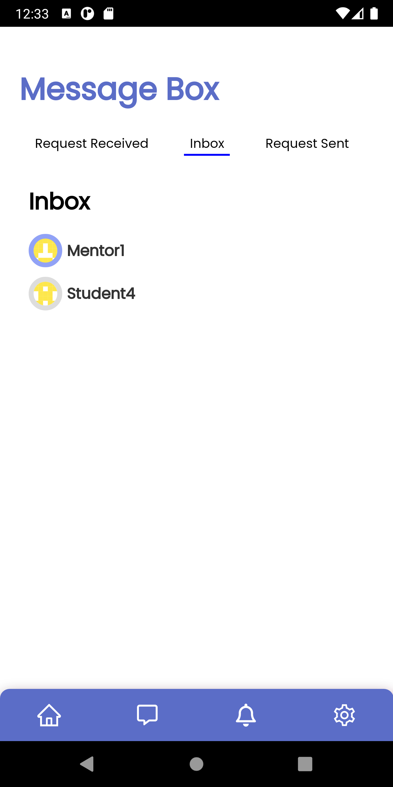
<br>
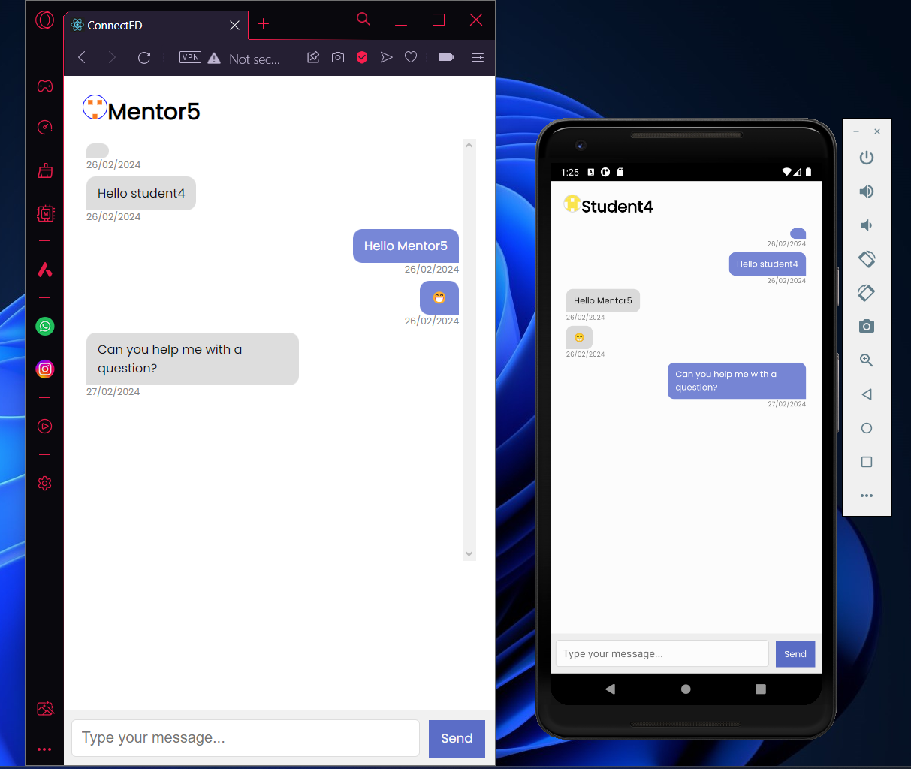